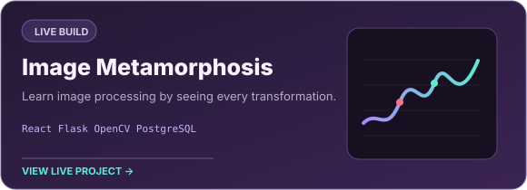
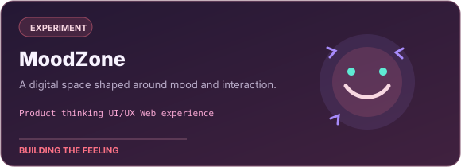
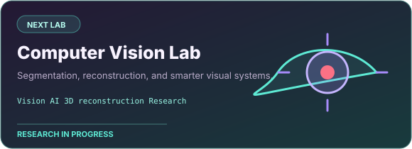
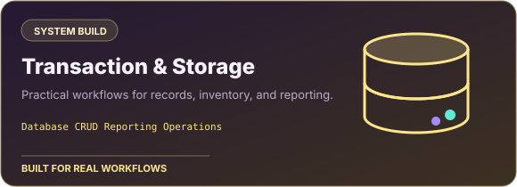

  

  
  
  

<h2 align="center">I like ideas better when they actually run.</h2>

  I build web products, management systems, and visual-computing experiments. 
  Usually somewhere between <strong>useful</strong>, <strong>educational</strong>, and <strong>wait... can this work?</strong>

## The build shelf

  
  

  
  

  <a href="https://github.com/UrLords/image-metamorphosis"><strong>ImageMeta source</strong></a>
  &nbsp;·&nbsp;
  <a href="https://github.com/UrLords?tab=repositories"><strong>Browse everything</strong></a>

## Tools I reach for

<strong>Languages & interface</strong>

  

<strong>Backend, data & APIs</strong>

  
  
  

<strong>Image processing & computer vision</strong>

  
  
  
  

<strong>Shipping & keeping it alive</strong>

  
  
  
  

## Activity, but make it arcade

<picture>
  <source media="(prefers-color-scheme: dark)" srcset="https://raw.githubusercontent.com/UrLords/UrLords/output/pacman-contribution-graph-dark.svg" />
  <source media="(prefers-color-scheme: light)" srcset="https://raw.githubusercontent.com/UrLords/UrLords/output/pacman-contribution-graph.svg" />
  
</picture>

  

  

  Built with curiosity, questionable amounts of browser tabs, and a preference for purple.

